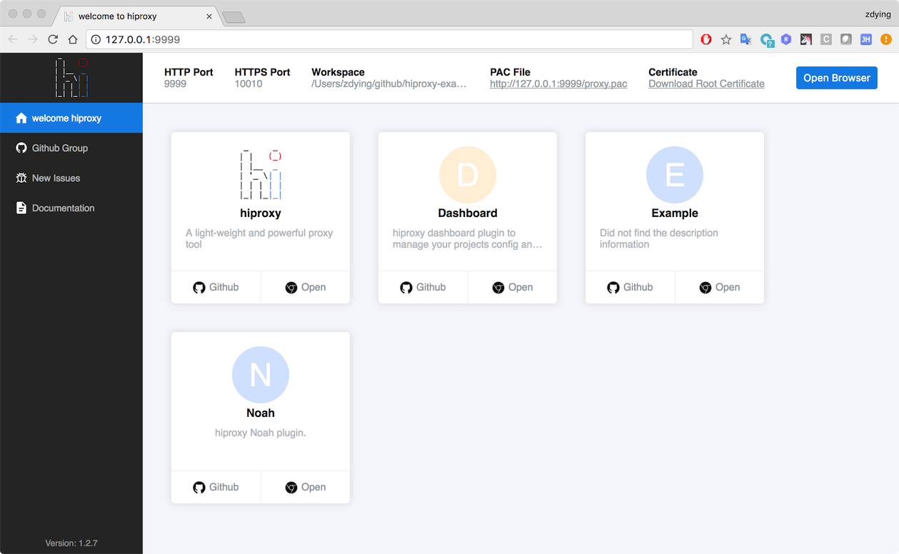

# Change Log

## [1.2.13] - 2018-03-14

### Added

* Support for automatic selection of available port numbers when creating services. 
* Add more test case.

## [1.2.12] - 2018-02-26

### Added

* Add `requestend` event. 
* Add `requestId` and `_startTime` for CONNECT request.
* Start HTTPS service by default.

## [1.2.11] - 2018-01-09

### Added

* Auto find config file from current dir.
* Add current config files log. 

## [1.2.10] - 2017-12-21

### Bugfix

* fix(command/start): can't found cli.js module on daemon mode [#43](https://github.com/hiproxy/hiproxy/pull/43)

Thanks to [raccoon-lee](https://github.com/raccoon-lee)

## [1.2.9] - 2017-11-08

### Bugfix

* Fixbug: window下无法创建名为*.xx.xx的证书 #40

## [1.2.8] - 2017-10-30

### Bugfix

* Fix plugin name for windows.

## [1.2.7] - 2017-10-24

### Added

* New hiproxy home page 🍺🍺🍺 👏👏👏

## [1.2.6] - 2017-10-19

### Bugfix

* Fix `hosts proxy` log error

### Added

* Directive can return promise or non-promise value now 
* Add `clearFiles()` api for `hiproxyServer.hosts` and `hiproxyServer.rewrite`
* Add `addRule()` api for hiproxy server instance
* Support custom `hosts` and `rewrite` snippets
* Add `hiproxy` global variable
* Add `dataProvider` module for plugins

### Updated

* change proxy log format

## [1.2.5] - 2017-10-10

### Bugfix

* Fix `alias` directive proxy log
* Change some log color from 'blue' to 'cyan'

### Added

* Domain block support multiple domain

## [1.2.4] - 2017-10-09

### Bugfix

* Fix error on windows
* Fix sub-command tips in help info

## [1.2.3] - 2017-09-21

### Added

* Add `requestId` for each request
* Show doc site url in `hiproxy` cmd and show new issue url in error msg

### Bugfix

* Response `data` event not emitted when use gzip

## [1.2.2] - 2017-09-18

### Added

* Change Hiproxy_Custom_CA_Certificate ext from pem to crt
* Add sub-command tips in help info

### Bugfix

* Plugins load error message has `undefined`

## [1.2.1] - 2017-09-12

### Added

* add `hiproxy init` CLI command
* Use `Hiproxy Custom CA` root certificate to issue `localhost` certificate

### Bugfix

* `send_file` directive bug

## [1.2.0] - 2017-09-04

### Added

* Regular expressions can omit the first `/` and last `/`
* Update proxy log format
* Use a more powerful syntax parser, and support main syntax error hints

## [1.1.9] - 2017-08-07

### Added

* Add built-in variable `$base_name` and `$dir_name`
* Add built-in API `enableConfFile` and `disableConfFile`

### Bugfix

* Response 404 when use `alias` and the request has query string.
