# Get And Install SSL Certificate

> 如果你愿意帮助hiproxy编写文档，请联系zdying@live.com, 谢谢！
>
> If you are willing to help hiproxy to write documentation, please contact zdying@live.com, thank you!

hiporxy会自己生成一个根证书，扮演CA的角色（Hiproxy Custom CA）。hiproxy在代理https请求的时候，会自动生成证书并使用hiproxy的根证书签名。

由于系统是不信任hiproxy根证书的，所以需要我们自己手动安装信任hiproxy的根证书。

## 下载证书

启动hiproxy服务之后（假设端口号是`5525`)，可以访问`http://127.0.0.1:5525/ssl-certificate`获取**Hiproxy Custom CA**的根证书。

这个地址，可以在`http://127.0.0.1:5525/`中找到，如下图：

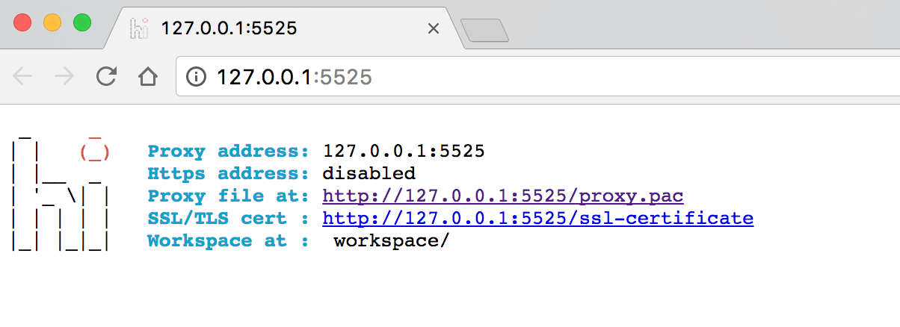

## 安装证书

下面将分别介绍OSX、iOS、Windows和Android中如何安装根证书。

### OSX系统

1. 下载完成根证书之后，双击`Hiproxy_Custom_CA_Certificate.pem`导入证书到钥匙串。

2. 在弹出的对话框中输入用户密码。

3. 此时证书是不受信任状态，双击刚才导入的证书。

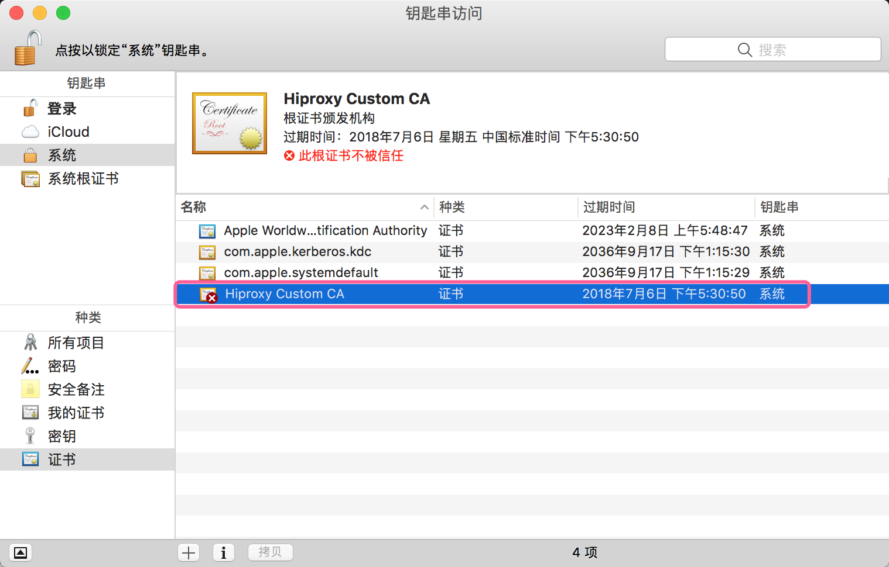

4. 在**信任** > **使用此证书时**下面选择**始终信任**。

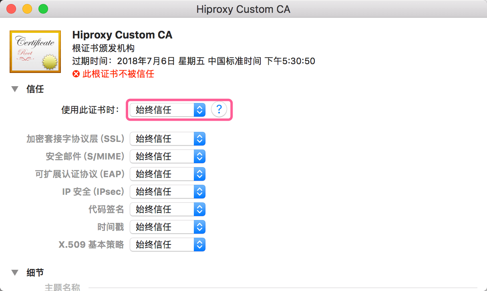

5. 关闭对话框，此时证书已经是被信任状态。

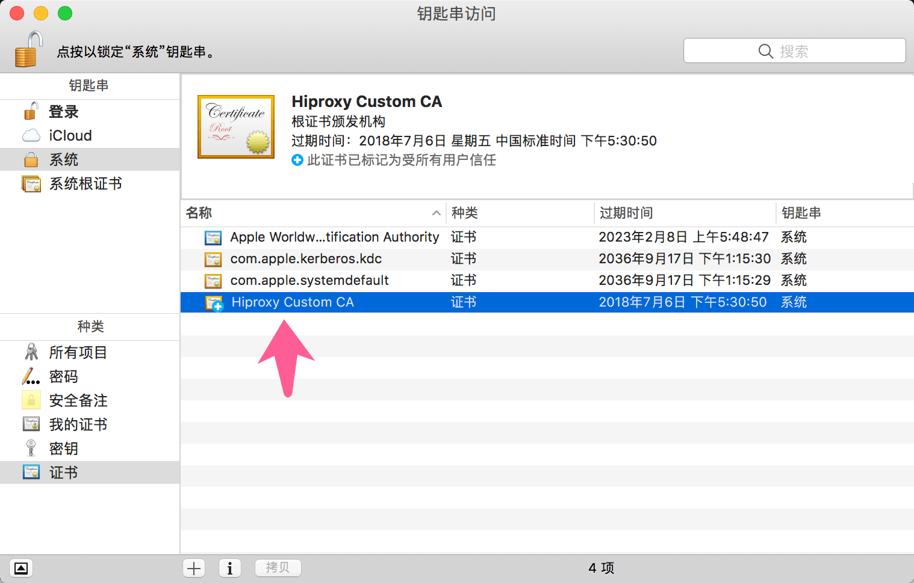

### iOS系统

1. 下载完成根证书之后发送到手机并打开。

2. 点击右上角的**安装**。

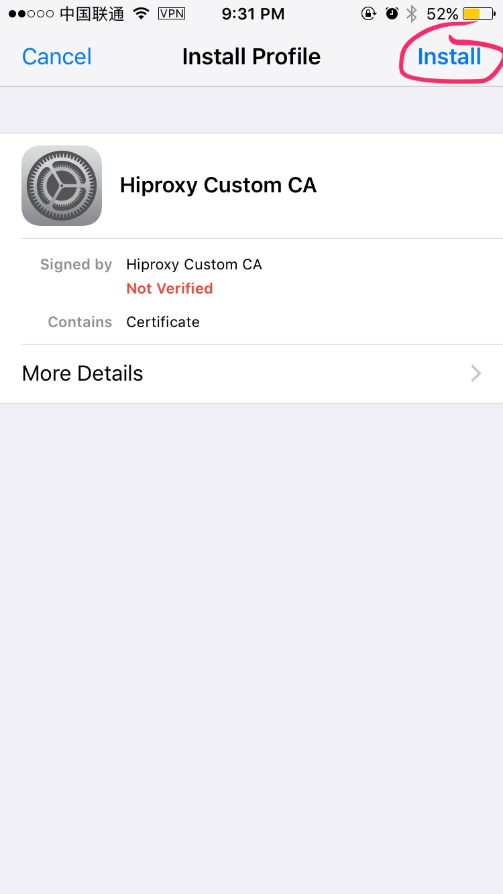

3. 再次点击右上角的**安装**。

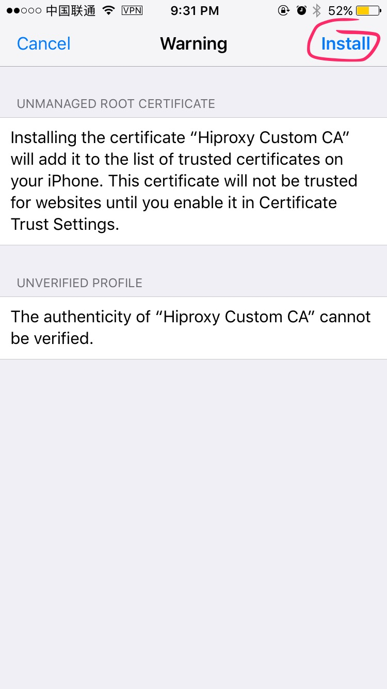

4. 完成安装，点击右上角**完成**退出。

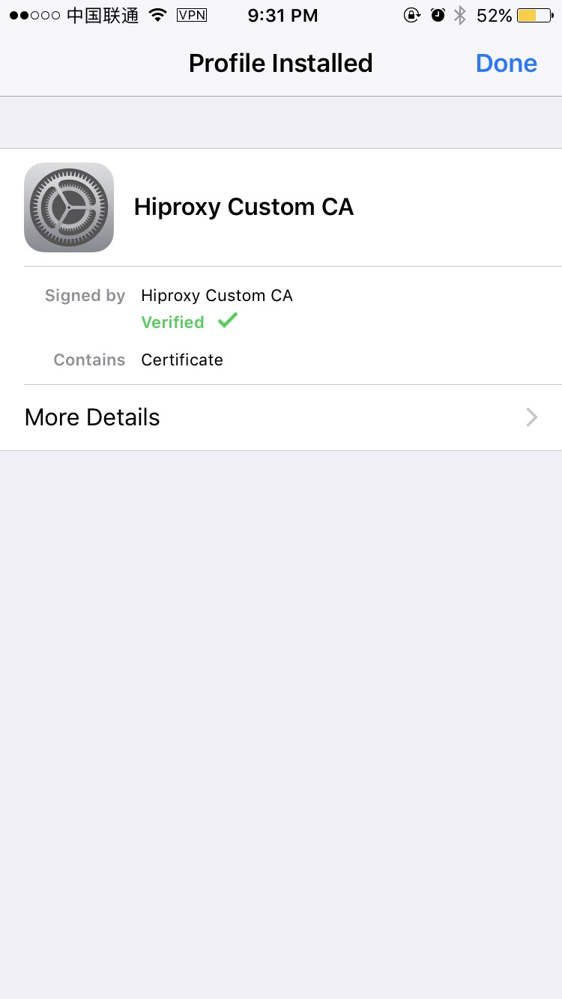

5. 如果**iOS系统版本 >= 10.3**，需要在**设置** > **通用** > **关于本机**中点击**证书信任设置**。

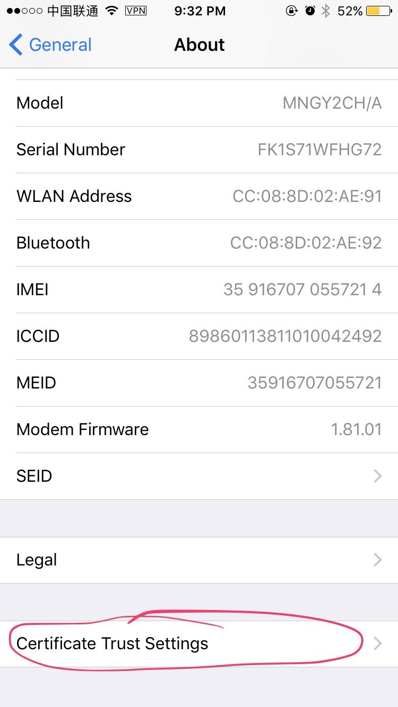

5. 打开开关**Hiproxy Custom CA**。

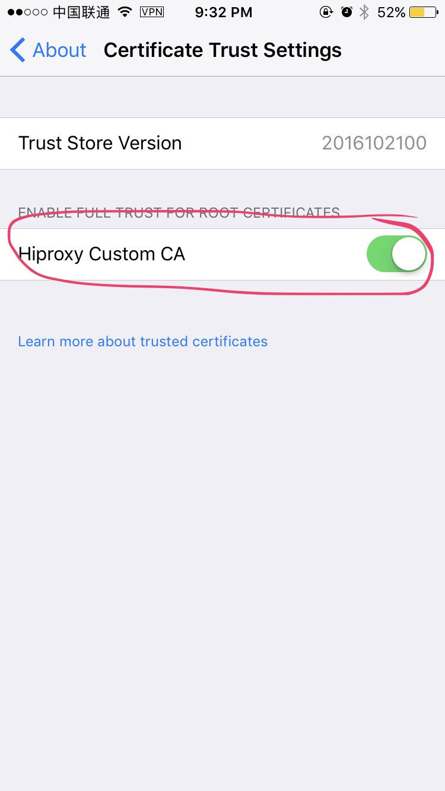

### Windows

1. 下载完成根证书之后，双击`Hiproxy_Custom_CA_Certificate.crt`安装证书。

2. 在弹出的对话框中点击**安装证书**。

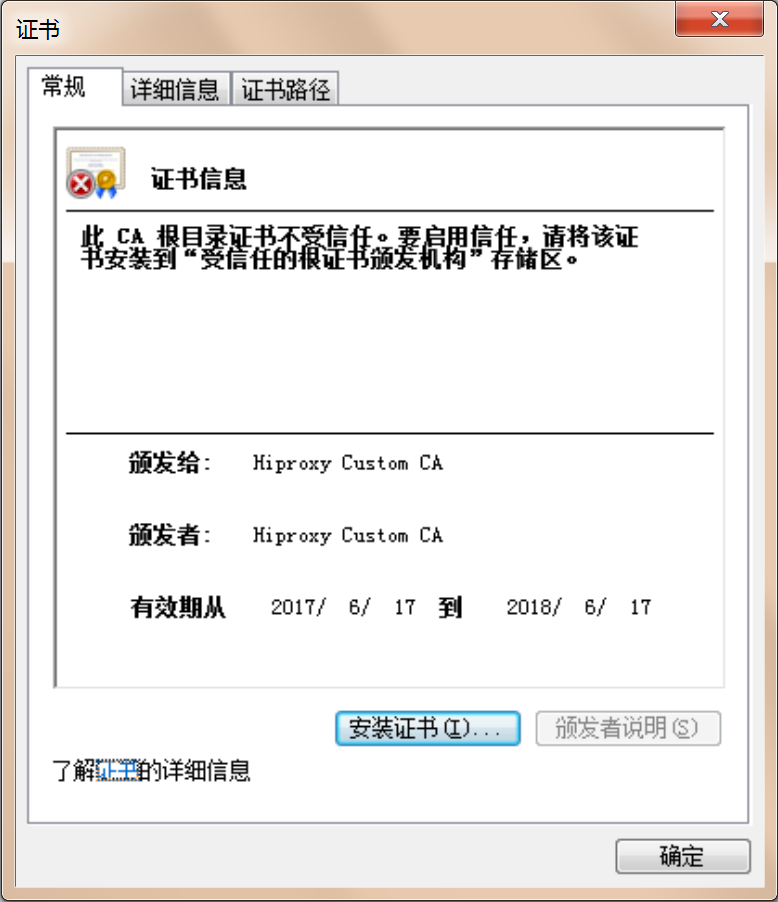

3. 点击**下一步**。

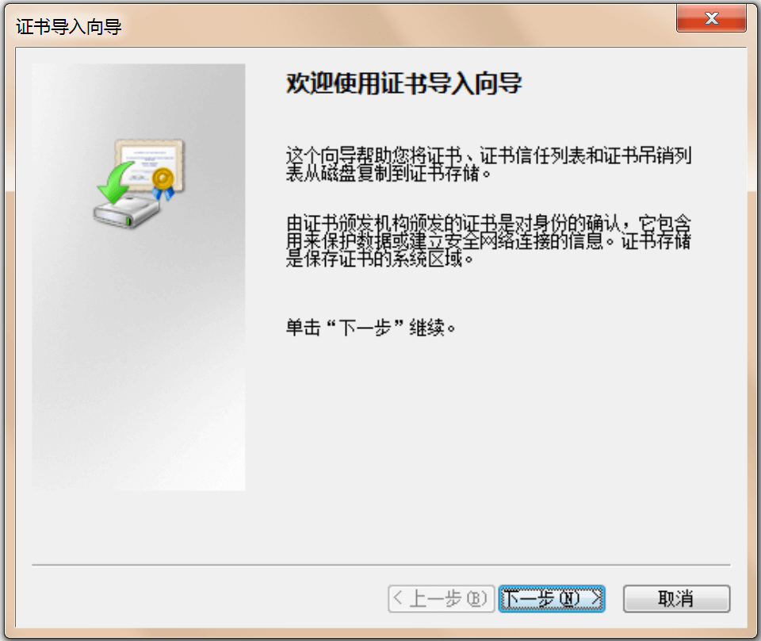

4. 选择**将所有的证书放入下列存储(P)**，点击**浏览(R)**，然后选择**受信任的根证书颁发机构**，点击**确定**。

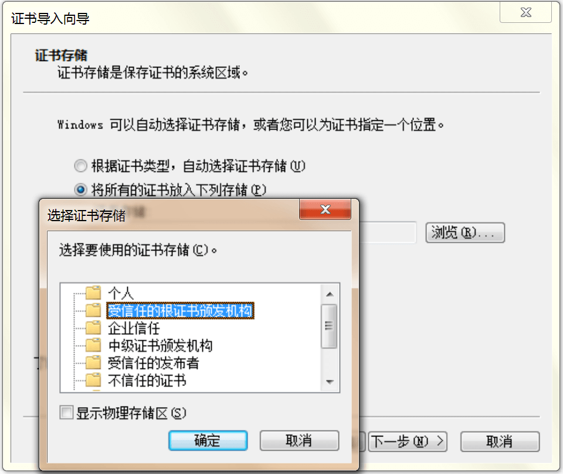

5. 点击**下一步**、**完成**。根据页面提示完成根证书安装。。

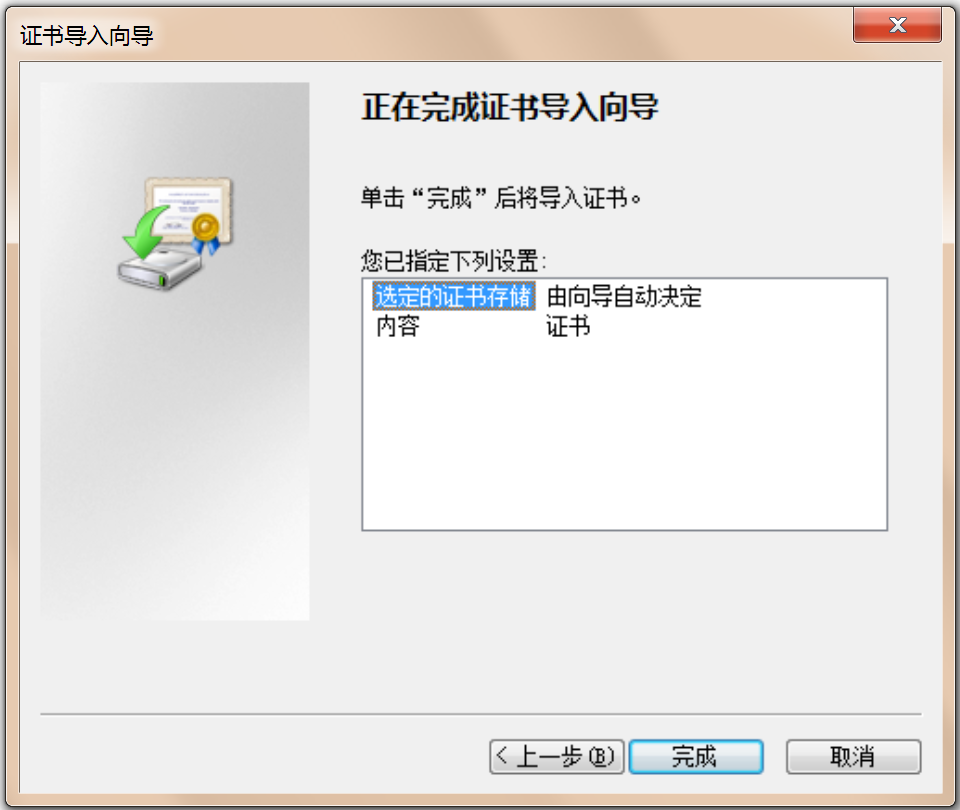

### Android

1. 下载完成根证书之后发送到手机。

2. 在**设置** > **安全**中点击**从SD卡安装**。

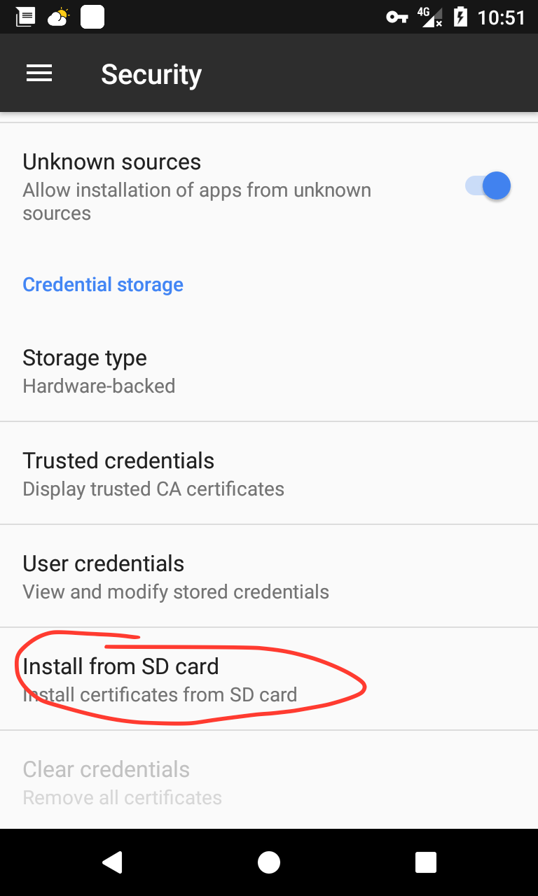

3. 输入解锁密码，然后输入证书名称，比如**HiproxyCustomCA**，点击**确定**。

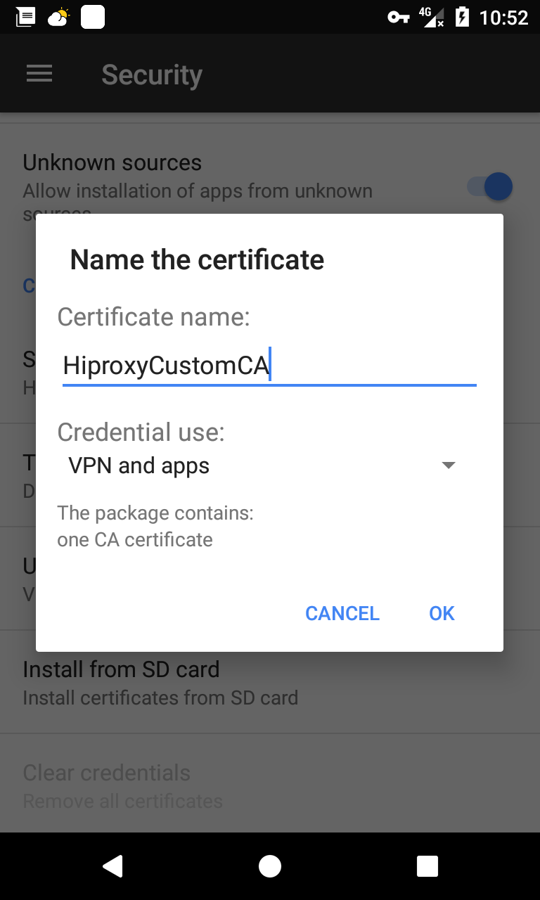

4. 在**设置** > **安全** > **受信任的证书** > **用户**中，如果能看到hiproxy的根证书，表示安装成功。

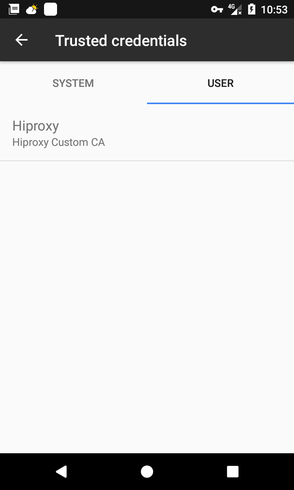
